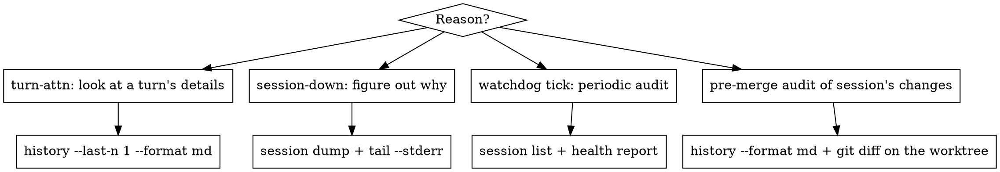

# Inspect codex-team

Read-only queries only. Nothing in this skill starts, cancels, or
compacts anything. Use `manage-codex-team` for writes,
`recover-codex-team` for remediation, and `compact-codex-team` for
compaction.

Before reaching for these commands, remember: the `events` stream
already told you what you need for routine turn-done handling. Most
inspection is for the *unusual* case — drift, failed turn, audit
before merge.

## The query table

| Question | Command |
|---|---|
| Which sessions exist and in what state? | `codex-team session list` |
| Full registry record for one session? | `codex-team session status <name>` |
| Combined state + pending queue + stderr tail + transport liveness? | `codex-team session dump <name>` |
| Health of all sessions (non-destructive)? | `codex-team health report` |
| Codex's own Markdown history of a session? | `codex-team history <name> [--last-n N] [--format md\|jsonl]` |
| Raw machine-readable turn records? | `codex-team history <name> --format jsonl [--last-n N]` |
| Tail of Codex's stderr for a session? | `codex-team tail <name> --stderr` |
| Queue contents? | `codex-team queue show <name>` |
| Daemon's own log? | `codex-team daemon logs [--follow]` |

### When to reach for each

- **`session list`** — first thing on watchdog ticks; also first thing
  after `auto-heal`.
- **`session status`** — for a single session you care about right
  now. Gives you `last_turn_id`, `last_turn_ended_at`,
  `token_usage_input`, `queue_length`.
- **`session dump`** — when a session is erroring and you need one
  call that combines registry + queue + stderr. First step in
  `recover-codex-team` too.
- **`health report`** — non-destructive aggregate. Use on every
  watchdog wake to confirm nothing drifted into `errored`.
- **`history <name>`** — after a `turn-attn` when the single-line
  summary isn't enough. `--format md` for human reading; `--last-n 1`
  to isolate the most recent turn; `--format jsonl --last-n 5` when
  you need structured access to recent turns.
- **`tail <name> --stderr`** — when `session-down` fired and you need
  to know *why* (OOM, auth expiry, crash trace, etc.).

## Decision tree: "Why am I looking?"

## Budgeting inspection calls

These calls are cheap individually, but if you call `session status`
in a tight loop "to see if the turn is done," **that is polling** and
you should re-read `using-codex-team`. Polling defeats the event-driven
design and bloats your context with repeated identical payloads.

Heuristic: at most one or two inspection calls per wake, and always in
service of a decision you are about to make. If you are not about to
decide, do not inspect.

## Reading `history` efficiently

`history.md` is append-only and can grow large. Patterns:

- `--last-n 1 --format md` — just the most recent turn, human-readable.
  Use after a `turn-attn`.
- `--last-n 3 --format md` — context for a multi-turn arc when Codex
  keeps asking questions.
- `--format jsonl --last-n 10` — when you want to programmatically
  count file changes, diff across turns, or extract commands.
- Full `history.md` — only when auditing before a merge.

## Reading `daemon logs`

The daemon's own log (`codex-team daemon logs`) is different from
per-session logs. It records:

- daemon lifecycle (start/stop/signal handling)
- `auto-resume` attempts after daemon restart
- background-loop failures
- UDS server errors

Use it when the *daemon* is misbehaving (e.g., sessions won't resume
after a daemon restart). For per-session issues, use `session dump`
and `tail --stderr`.

## Red flags

| Thought | Correction |
|---|---|
| "Let me run `session status` every 10 seconds until it says idle." | Polling. Arm events stream (`watch-codex-team`), then sleep. |
| "I'll read the full `history.md` just in case." | Target your read with `--last-n`. Full history is only for merge audits. |
| "Nothing is wrong but I want to see the queue." | Fine — one call, then decide. Do not loop. |
| "stderr is empty, the session must be healthy." | Healthy sessions have empty stderr. That is not a reason to keep looking. |

## Cross-references

- After reading, to act: `manage-codex-team` (send) or
  `recover-codex-team` (triage)
- If the thing you want to look at is a compaction threshold advisory:
  `compact-codex-team`
- If you are looking because events stopped arriving: `watch-codex-team`
  first — debugging a silent plugin monitor is cheaper than
  inspection-polling.
