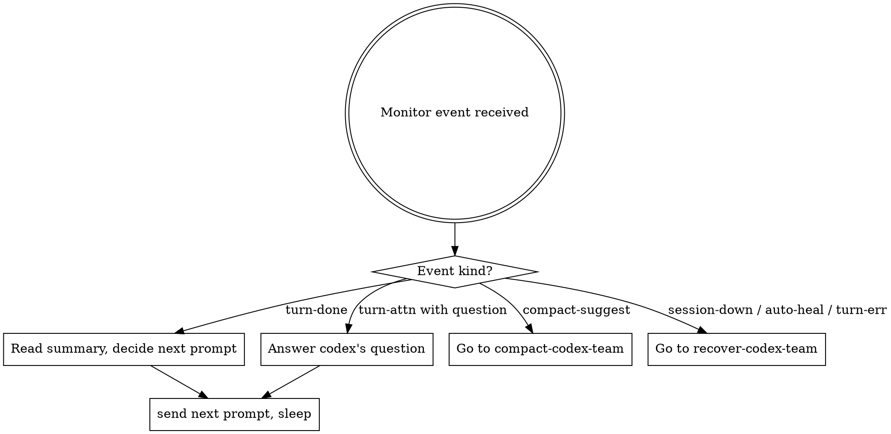

# Manage codex-team sessions

This is the main workflow skill. Everything you do *to* a session
(create, send, interrupt, compact, close) happens through the
`codex-team` CLI invoked from `Bash`.

Before reading: you should already know the mental model from
`using-codex-team` and have both Monitor streams armed (see
`watch-codex-team`).

## Session lifecycle

```
  (nothing)
     │
     │  codex-team session create <name> --cwd <path> [--profile X]
     ▼
   idle ◄────────────────────── turn/completed
     │                              ▲
     │  codex-team send <name> ...  │
     ▼                              │
   running ──────────────────── codex finishes
     │                              │
     │  codex-team interrupt <name> │
     └──────────────────────────────┘
     │
     │  codex-team session close <name>
     ▼
   closed  (thread preserved; can session resume <name>)
```

Plus recovery states (`errored`, `compacting`) covered in
`recover-codex-team` and `compact-codex-team`.

## Create a session

```
codex-team session create <name> \
    --cwd <absolute-path> \
    --profile refactor            # omit if you want defaults.model / defaults.sandbox
```

The session name is your handle forever; pick something structural
(e.g. `L-kernels`, `L-bench`), not ad hoc (`test1`).

Key facts:

- Each session spawns its own `codex app-server` subprocess. Four
  sessions = four subprocesses; that is intentional.
- `--cwd` is Codex's working directory, usually a git worktree you
  created beforehand.
- `--profile <name>` pulls defaults from `[profiles.<name>]` in
  `config.toml`. Prefer profiles over long flag lists.
- Sandbox defaults to `danger_full_access` and approval to `never` —
  Codex will edit and run commands without asking. This is YOLO mode;
  the plugin is designed for it. Do not "fix" this to a safer default
  unless the user explicitly asks.
- Reasoning effort defaults to `xhigh`. Do not downgrade unless the
  user explicitly asks.

## Send a prompt (the main loop)

```
codex-team send <name> "<prompt>"
```

**Default is non-blocking.** The command returns as soon as the turn
has been queued/started; the turn itself can take minutes. You will
learn the outcome through the `events` Monitor stream, not through
this command's stdout.

### When to use `--wait`

Almost never. `--wait` blocks the CLI (and therefore your Bash call)
until `turn/completed` arrives. That wastes your context window and
serializes work. Use it only when:

- You are interactively debugging a single session and want a synchronous
  REPL-like feel.
- You are running a post-condition in a script that genuinely needs
  the turn result inline.

For the normal orchestration loop: **send, then sleep**. The next
event arrives through Monitor.

### Send-prompt style

Keep send prompts short and by-reference, not self-contained. The
session already has its own history and its own `progress.md`; do not
re-describe the task inside the send.

Bad (too much context, duplicates progress.md):

```
codex-team send L-kernels "You are working on the kernels refactor.
Your job is to convert the torch CPU code to numba, following the
rules in section 4 of the spec. Currently you have completed
_kernel_nb_logpmf. The next task is _kernel_nb_logcdf. Please..."
```

Good (short, by-reference):

```
codex-team send L-kernels "continue: read docs/refactor/L-kernels/progress.md Next up, tackle the top item, update Progress/Findings/Next up when done"
```

When a turn returned with a question you need to answer, the answer
goes in the next send verbatim — no extra framing:

```
codex-team send L-kernels "relax the tolerance to 1e-5; re-enable fastmath and re-run the two failing tests"
```

### Prompt sources: `--stdin` and `--prompt-file`

For a multi-line prompt, use stdin or a file instead of embedding
quotes:

```
codex-team send L-kernels --stdin <<'EOF'
Your task has two parts:
1. ...
2. ...
EOF

# or
echo "..." > /tmp/prompt.md
codex-team send L-kernels --prompt-file /tmp/prompt.md
```

Use sparingly. Long prompts are a code smell — put the spec in a doc
and reference it.

## Per-turn overrides

Any of these can be passed on a single `send` to override the session
defaults for that one turn, without recreating the session:

```
codex-team send <name> "<prompt>" \
    --model gpt-5.4-mini \        # switch model for this turn only
    --cwd /some/other/path \      # run the turn in a different cwd
    --effort high \               # downgrade reasoning for a trivial turn
    --personality concise \       # style toggle
    --summary detailed \          # reasoning-summary verbosity
    --output-schema-file X.json   # enforce structured output
```

Do not override lightly. Session defaults exist for good reasons
(xhigh effort, danger_full_access sandbox, your chosen model). Override
only when a specific turn genuinely needs something else.

## Queue behaviour

If you send again while a session is already `running`, the new prompt
is **queued**, not rejected. The queue is per-session, max length 5 by
default. When the current turn completes, the daemon automatically
dispatches the next queued prompt and emits another `turn-done`.

Consequences:

- You can pipeline: `send A "step 1"`, then without waiting,
  `send A "step 2"`. They run sequentially.
- Queue depth is visible on the watchdog and via
  `codex-team queue show <name>`.
- If queue is full the default policy is `warn` (still enqueues,
  emits a `queue-overflow` event). If you changed the policy to
  `reject`, your send will fail with `E_QUEUE_FULL` — configure in
  `config.toml`.

## Interrupt

```
codex-team interrupt <name>
```

Cancels the currently running turn at the next safe point. The turn
emits `turn-done` with status `errored` or partial state, and the
queue (if any) continues. Use when:

- Codex is looping on a non-productive line of reasoning.
- You need to redirect after receiving partial results.
- Cost control: a long high-effort turn has already produced the
  valuable output and is now polishing.

## Close

```
codex-team session close <name>
```

Stops the app-server subprocess, marks the session `closed`, but
**preserves the thread**. You can later `session resume <name>` to
re-attach a fresh subprocess to the same conversation history.

For permanent removal use `session forget <name>` (registry entry
deleted; Codex-side thread still exists and could be re-attached by
creating a session with the same `thread_id`).

## The per-session progress doc

Each session is expected to maintain one append-only Markdown file,
typically `docs/refactor/<session>/progress.md`, with sections:

```
## Current task
## Progress (newest on top)
## Findings & decisions
## Open questions / blockers
## Next up
```

Your send prompts refer to this file ("continue Next up", "update
Findings with X", etc.) and the Codex session reads + updates it every
turn. This lets both sides compact state without you re-typing every
time.

If the file does not exist when you first create the session, your
opening send should instruct Codex to create it.

## Decision tree on every Monitor wake



## Red flags

| Thought | Correction |
|---|---|
| "I'll use `--wait` to simplify this." | Use the default async; keep the Monitor loop. |
| "Let me stuff the full task description into the send." | Reference `progress.md` instead. |
| "Session is slow — maybe I'll switch to `--effort minimal`." | Do not. Defaults are picked deliberately (`xhigh`). Override only if the user asked. |
| "This session has been running 5 minutes, something must be wrong." | Turns can take tens of minutes at `xhigh`. Wait for `turn-done` or check the heartbeat event for `turn-stuck` first. |
| "I'll send a new prompt to cancel the current turn." | Send queues. Use `codex-team interrupt <name>` to actually cancel. |

## Cross-references

- Before sending: `using-codex-team` (mental model) + `watch-codex-team`
  (monitors armed)
- After a `turn-done` that needs inspection: `inspect-codex-team`
- On `[compact-suggest]`: `compact-codex-team`
- On `[session-down]` / `[turn-err]`: `recover-codex-team`
